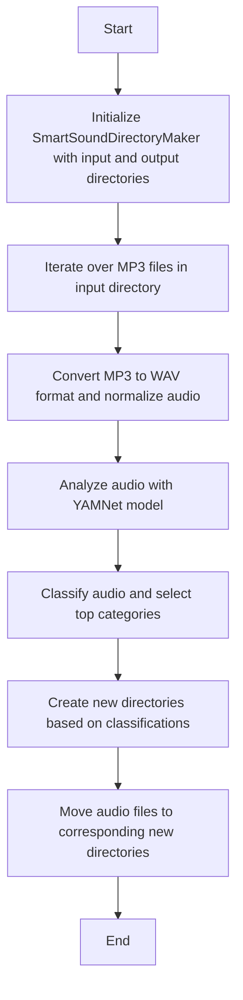

# Audio Scripts
### SmartSoundDirectoryMaker

`SmartSoundDirectoryMaker` automates the process of analyzing and categorizing audio files into organized directories based on their content.


# Python venv explanation
When someone or myself picks this project up and want to run python here they should:

1. Create a new virtual environment in their local setup (using virtualenv or similar tools).
```bash
pip3 install virtualenv              
virtualenv env
```
2. Activate the newly created virtual environment.
```bash
source venv/bin/activate   
```
Install the required dependencies using `pip install -r requirements.txt` 
This command installs all the packages listed in requirements.txt into the virtual environment.
